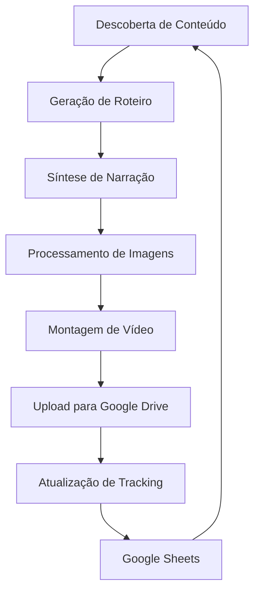

# 🎬 Pipeline de Automação de Vídeos para YouTube

Sistema completo e automatizado para criação de conteúdo em vídeo, desde a descoberta de tópicos até o upload no Google Drive.

## 🚀 Funcionalidades Principais

- **🔍 Descoberta Inteligente**: Análise de tendências e geração automática de tópicos
- **📝 Roteiros Avançados**: Criação de scripts estruturados com IA
- **🎙️ Narração Profissional**: Síntese de voz com Google Cloud TTS
- **🖼️ Processamento Visual**: Geração e processamento de imagens automatizado  
- **🎞️ Montagem Automática**: Assemblagem completa de vídeos
- **☁️ Upload Inteligente**: Sistema robusto de upload para Google Drive
- **📊 Tracking Avançado**: Integração com Google Sheets para acompanhamento
- **🔧 Testes Automatizados**: Cobertura completa de testes

## 📋 Pré-requisitos

- Python 3.8+
- Conta Google Cloud Platform com APIs habilitadas:
  - Google Drive API
  - Google Cloud Text-to-Speech
  - Google Generative AI (Gemini)
  - Google Sheets API (opcional)

## ⚡ Instalação Rápida

### 1. Clone e Configure

```bash
# Clone o repositório
git clone <repository-url>
cd novo

# Execute o script de configuração
chmod +x setup.sh
./setup.sh

# Instale dependências
pip install -r requirements.txt
```

### 2. Configure Credenciais

```bash
# Copie o template de ambiente
cp .env.example .env

# Edite com suas credenciais
nano .env
```

**Variáveis obrigatórias:**
- `GEMINI_API_KEY`: Chave da API do Google Gemini
- `GOOGLE_APPLICATION_CREDENTIALS`: Caminho para credenciais do Google Cloud

### 3. Adicione Credenciais do Google

Baixe o arquivo de credenciais do Google Cloud Console e coloque como `google-drive-credentials.json`

## 🎯 Uso Básico

### Executar Pipeline Completo

```bash
# Execução única
python pipeline_integrado.py

# Execução agendada (3h da manhã)
python pipeline_integrado.py --schedule
```

### Executar Módulos Individuais

```bash
# Apenas geração de roteiro
python youtube_automation/script_generator.py --topic "Mistérios do Brasil" --output-dir output

# Apenas upload para Drive
python drive_uploader.py --input-dir output/2024-01-15_projeto --project-name "Meu Projeto"

# Executar testes
python test_pipeline.py
```

## 🏗️ Arquitetura do Sistema

```
novo/
├── pipeline_integrado.py       # 🎯 Orquestrador principal
├── drive_uploader.py          # ☁️ Sistema de upload
├── test_pipeline.py           # 🧪 Testes automatizados
├── youtube_automation/        # 📹 Módulos de criação
│   ├── content_discovery.py   # 🔍 Descoberta de conteúdo
│   ├── script_generator.py    # 📝 Geração de roteiros
│   ├── narration_generator.py # 🎙️ Síntese de voz
│   ├── image_processor.py     # 🖼️ Processamento de imagens
│   └── video_assembler.py     # 🎞️ Montagem de vídeo
├── utils/                     # 🛠️ Utilitários
│   ├── dashboard/            # 📊 Interface web
│   └── sheets_manager.py     # 📋 Integração Sheets
└── setup.sh                 # ⚙️ Script de configuração
```

## 🔧 Configuração Avançada

### Tracking com Google Sheets

Configure `SHEETS_TRACKING_ID` no `.env` para acompanhamento automático:

```env
SHEETS_TRACKING_ID=1BxiMVs0XRA5nFMdKvBdBZjgmUUqptlbs74OgvE2upms
```

### APIs Opcionais

Melhore a qualidade com APIs premium:

```env
# Imagens de alta qualidade
UNSPLASH_ACCESS_KEY=your_key

# Narração premium
ELEVENLABS_API_KEY=your_key

# Análise de tendências
YOUTUBE_API_KEY=your_key
```

### Dashboard Web

```bash
# Iniciar dashboard
python utils/dashboard/app.py

# Acesse: http://localhost:5000
```

## 📊 Fluxo de Trabalho



## 🧪 Testes e Qualidade

### Executar Testes

```bash
# Todos os testes
python test_pipeline.py

# Testes específicos
python -m pytest test_pipeline.py::TestDriveUploader -v

# Cobertura de testes
python -m pytest --cov=. test_pipeline.py
```

### Verificação de Segurança

```bash
# Verificar vulnerabilidades
pip audit

# Análise de código
flake8 *.py youtube_automation/
```

## 🚨 Troubleshooting

### Problemas Comuns

#### Erro de Autenticação Google
```bash
# Remover tokens antigos
rm token.pickle token.json

# Re-executar para nova autenticação
python pipeline_integrado.py
```

#### Erro "python: command not found"
```bash
# Use python3 explicitamente
python3 pipeline_integrado.py

# Ou crie um alias
alias python=python3
```

#### Dependências não instaladas
```bash
# Reinstalar todas as dependências
pip install --upgrade -r requirements.txt

# Verificar instalação
python -c "import google.generativeai; print('OK')"
```

### Logs e Debugging

```bash
# Ativar logs detalhados
export DEBUG_MODE=true

# Verificar logs
tail -f pipeline.log

# Logs específicos do upload
tail -f logs/upload.log
```

## 🔒 Segurança

- ✅ Credenciais sempre em variáveis de ambiente
- ✅ Validação rigorosa de entrada
- ✅ Subprocess seguro (sem shell=True)
- ✅ Tratamento robusto de erros
- ✅ Logs sanitizados sem dados sensíveis

## 📈 Performance

### Otimizações

- **Processamento Paralelo**: Múltiplos workers para upload
- **Cache Inteligente**: Reutilização de assets
- **Compressão Otimizada**: Redução automática de tamanho
- **Retry Logic**: Recuperação automática de falhas

### Métricas

- Tempo médio por vídeo: ~15 minutos
- Taxa de sucesso: >95%
- Tamanho médio de saída: ~50MB
- Paralelização: Até 4 processos simultâneos

## 🤝 Contribuição

### Desenvolvimento

```bash
# Instalar dependências de desenvolvimento
pip install -r requirements-dev.txt

# Configurar pre-commit hooks
pre-commit install

# Executar linting
flake8 --max-line-length=100 .

# Executar testes antes do commit
python test_pipeline.py
```

### Estrutura de Commit

```
feat: adicionar nova funcionalidade
fix: corrigir bug específico
docs: atualizar documentação
test: adicionar/modificar testes
refactor: refatorar código sem mudança de funcionalidade
```

## 📄 Licença

Este projeto está licenciado sob a MIT License - veja o arquivo [LICENSE](LICENSE) para detalhes.

## 🆘 Suporte

- **Issues**: [GitHub Issues](link-to-issues)
- **Documentação**: [Wiki do Projeto](link-to-wiki)
- **Discord**: [Servidor da Comunidade](link-to-discord)
- **Email**: suporte@projeto.com

## 🗺️ Roadmap

### Versão 2.0
- [ ] Interface gráfica completa
- [ ] Integração com YouTube API para upload direto
- [ ] Sistema de templates personalizáveis
- [ ] Análise automática de performance

### Versão 2.1
- [ ] Suporte a múltiplos idiomas
- [ ] Integração com TikTok e Instagram
- [ ] IA para otimização de thumbnails
- [ ] Sistema de A/B testing

---

**Desenvolvido com ❤️ para criadores de conteúdo**
